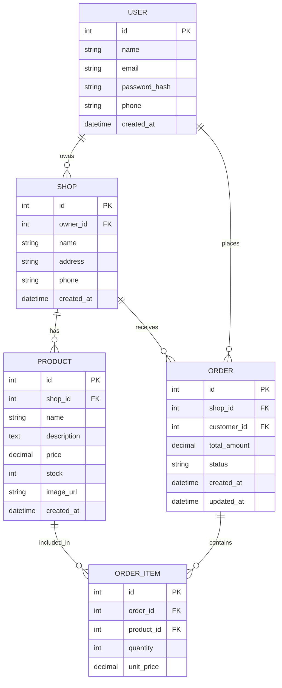

# ERD (Entity-Relationship Diagram) — Deskripsi & Mermaid
Berikut adalah skema ERD tingkat MVP.

Mermaid diagram (diagram dapat divisualisasikan menggunakan Mermaid support):

Catatan: Untuk implementasi Firebase, struktur collection bisa mengikuti: users -> shops -> products, orders (top-level or under shops).
