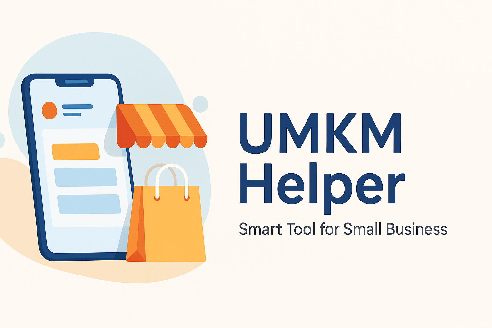

<p align="center">
  
  
  
  
</p>

---

<h1 align="center">📱 UMKM Helper</h1>
<p align="center">
  <em>Aplikasi Mobile Flutter untuk Digitalisasi UMKM — Fokus pada efisiensi, kesederhanaan, dan workflow cerdas berbasis dokumen</em>
</p>

<p align="center">
  
</p>

<p align="center">
  
  
</p>

---

## 🧭 Deskripsi Singkat
**UMKM Helper** adalah aplikasi mobile berbasis **Flutter** untuk membantu pelaku **Usaha Mikro, Kecil, dan Menengah (UMKM)** dalam mengelola produk, pesanan, dan laporan penjualan. Aplikasi dikembangkan dengan pendekatan **Document-First & Agile Workflow**, mengutamakan dokumentasi dan perencanaan sebelum implementasi kode.

---

## 🎯 Tujuan & Manfaat

### 🎯 Tujuan:
- Membantu digitalisasi UMKM tanpa sistem kompleks.
- Menyediakan platform mobile ringan dan cepat untuk manajemen bisnis.
- Membangun dasar arsitektur yang scalable dan mudah dikembangkan.

### 🌟 Manfaat:
- Menghemat waktu dalam manajemen stok dan pesanan.  
- Memberikan wawasan bisnis melalui laporan otomatis.  
- Dapat digunakan **offline-first**, sinkron otomatis ketika online.

---

## ⚙️ Fitur Utama (MVP)
| Modul | Deskripsi |
|-------|------------|
| 🔐 **Autentikasi Pengguna** | Login & registrasi (Email, Google Sign-In). |
| 🛍️ **Manajemen Produk** | CRUD produk + foto, stok, harga. |
| 📦 **Manajemen Pesanan** | Buat dan ubah status pesanan. |
| 📊 **Dashboard & Laporan** | Pendapatan harian & ekspor CSV. |
| 🔔 **Notifikasi Lokal** | Pesanan baru, perubahan status. |
| ☁️ **Sinkronisasi Cloud** | Firebase untuk data dan storage. |

---

## 🧩 Arsitektur Sistem
```Flutter App
├── UI Layer (View)
├── State Management (Riverpod / Provider)
├── Local DB (Hive / SQLite)
├── Cloud DB (Firebase Firestore)
├── Storage (Firebase Storage)
└── Sync Service (Offline-first)
```
---

📡 **Alur Data:**
1. Pengguna memperbarui produk → disimpan ke database lokal.  
2. Sinkronisasi otomatis saat perangkat online.  
3. Firebase digunakan untuk autentikasi dan penyimpanan data utama.

---

## 📘 Dokumen Spesifikasi
| Dokumen | Deskripsi |
|----------|------------|
| 📄 [`PRD.md`](./PRD.md) | Product Requirement Document |
| 🧭 [`ERD.md`](./ERD.md) | Entity Relationship Diagram |
| 🧾 [`SRS.md`](./SRS.md) | Software Requirements Specification |
| 🧩 [`SDD.md`](./SDD.md) | Software Design Document |
| 📅 [`SPRINT_CHECKLIST.md`](./SPRINT_CHECKLIST.md) | Sprint Planning & Timeline MVP |

---

## 🧠 Teknologi & Tools

| Kategori | Teknologi / Alat |
|-----------|------------------|
| Framework | Flutter (Dart) |
| Backend | Firebase (Auth, Firestore, Storage) |
| Database Lokal | Hive / SQLite |
| State Management | Riverpod / Provider |
| Dokumentasi | Markdown, Mermaid, Figma |
| Version Control | Git & GitHub |

---

## 🚀 Rencana Pengembangan (Sprint MVP)
| Sprint | Fokus | Hasil Utama |
|--------|--------|--------------|
| 0 | Setup & Planning | Repo GitHub, Firebase, dokumentasi awal |
| 1 | Auth & Navigasi | Login, register, struktur app |
| 2 | Product CRUD | Manajemen produk & cache lokal |
| 3 | Orders | Flow pesanan & update stok |
| 4 | Dashboard & Laporan | Ringkasan penjualan, CSV export |
| 5 | Notifikasi & Testing | Notifikasi, bug fix, polish |
| 6 | Release | Build APK & testing akhir |

---

## 💡 Keunggulan Dibanding Kompetitor
- **Sederhana & Fokus:** UI intuitif bagi pengguna non-teknis.  
- **Offline-First Sync:** Dapat digunakan tanpa koneksi internet stabil.  
- **AI-Assisted Planning (Future):** Integrasi AI untuk rekomendasi laporan & prediksi penjualan.  
- **Document-First Workflow:** Perencanaan berbasis dokumen untuk efisiensi dan kejelasan pengembangan.  
- **Lightweight:** Performa optimal di perangkat low-end.

---

## 📈 KPI Sukses MVP
| Indikator | Target 30 Hari |
|------------|----------------|
| 👥 Pengguna Terdaftar | 100+ |
| 🏪 Merchant Aktif | 30+ |
| 🧾 Transaksi Tercatat | 500+ |
| 📊 Retensi Pengguna | >70% |

---

## 👨‍💻 Pengembang
**Nama:** Muhammad Isa Maulana
**NIM:** 211240001099
**Program Studi:** Teknik Informatika — UNISNU Jepara  
**Mata Kuliah:** Pemrograman Mobile Lanjut  
**Dosen:** Akhmad Khanif Zyen, M.Kom  

---

## 📜 Lisensi
Proyek ini dikembangkan untuk tujuan edukasi.  
Lisensi: **MIT License**  

---

## 🌐 Referensi
- Martin, R. C. (2017). *Clean Architecture.*  
- Flutter & Dart Documentation — [https://docs.flutter.dev](https://docs.flutter.dev)  
- Knaster, M. (2020). *Sprint: How to Solve Big Problems and Test New Ideas in Just Five Days.*  
- Akhmad Khanif Zyen (2024). *Mendefinisikan Ulang Workflow Software Development: Strategi Cerdas Menggunakan AI (Document-First).* — Medium.com

